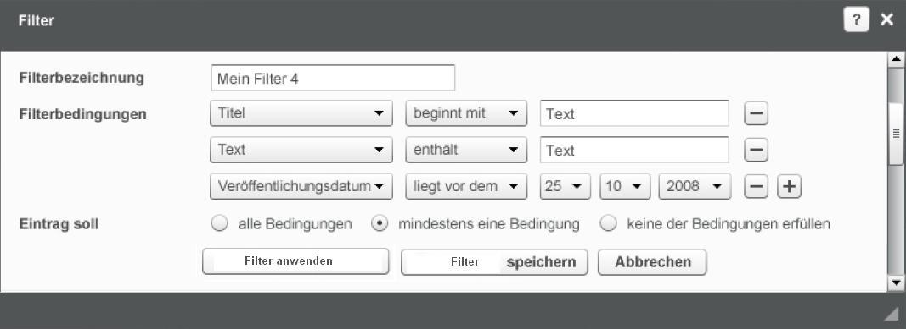

# Wisercat test job



## Start examples
You must have Docker installed and docker-compose.

- https://docs.docker.com/install/
- https://docs.docker.com/compose/install/

 
1. Create and configure ports and etc. for docker containers
```
cp .env.dist .env
```
2. Start docker containers
```
docker-compose up
```
3. Open in browser http://localhost:3000/ 

